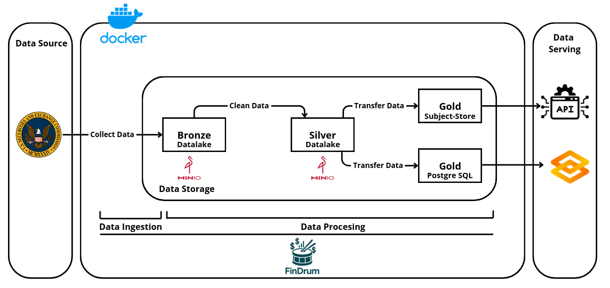
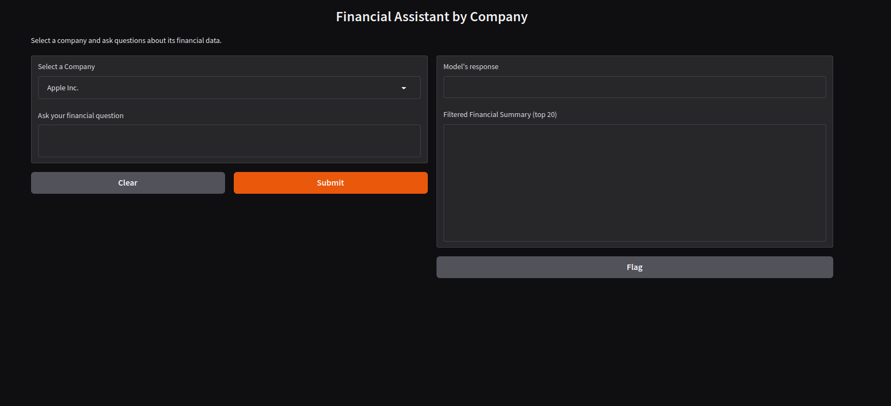
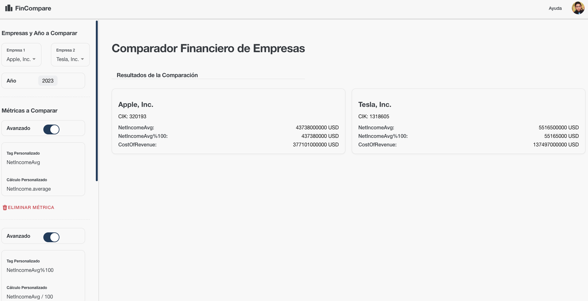

# Medallion Architecture – Financial QA with LLMs & Comparative Analysis API

This repository implements a **Medallion Architecture** (Bronze–Silver–Gold) using **FinDrum**, enabling two advanced applications:

1. A **financial Q&A chatbot** powered by local LLMs.
2. A **declarative comparative analysis API** built on a Subject Store.

---

## Architecture Overview



| Layer  | Responsibility                                   | Storage / Destination                                 |
| ------ | ------------------------------------------------ | ----------------------------------------------------- |
| Bronze | Raw ingestion from SEC API, with metadata        | JSON files in MinIO `bronze/` bucket                  |
| Silver | Cleaning, normalization, and semantic enrichment | Parquet files in MinIO `silver/` bucket               |
| Gold   | Structured data for Q&A and API consumption      | PostgreSQL (`financial_data` table) and Subject Store |

Data flows through Docker containers, orchestrated by FinDrum and triggered by MinIO events.

---

## Bronze – Raw Data Ingestion

A daily pipeline (scheduled at 10:20) ingests SEC `companyfacts` for selected companies (e.g., Apple, Tesla):

- **SecFactSource** fetches raw financial facts via API.
- **MinioWriter** stores raw JSON files in `bronze/` bucket.

---

## Silver – Data Cleaning and Normalization

Triggered by new files in `bronze/` bucket:

# FinDrum-Project1

1. **DictFlattener** converts nested JSON to flat structure.
2. **ValueFilter** / **ColumnFilter** remove irrelevant or malformed records.
3. **ValueMapper** harmonizes financial terms (e.g., `NetIncome`, `Assets`).
4. The result is written as Parquet files into MinIO’s `silver/` bucket.

---

## Gold – Financial Q&A via LLMs

Triggered by new Silver Parquet files:

1. **MinioReader** reads the Parquet data.
2. **ValueMapper** extracts fiscal year info (e.g., `CY2021`) using regex.
3. **ColumnFilter** removes unnecessary columns.
4. **PostgresInsertOperator** inserts cleaned data into `financial_data` table.

Local LLMs (`OpenHermes‑2.5‑Mistral‑7B`, `Meta‑LLaMA‑3‑8B‑Instruct`, via llama.cpp) answer queries such as “What was Apple's net income in 2021?” using a Gradio interface:



---

## Gold – Declarative Comparative Analysis API

Another Silver-to-Gold pipeline:

1. **MinioReader** loads Silver data.
2. **InferMissingQuarters** fills missing quarterly data based on annual totals.
3. **ValueFilter** ensures quarterly records.
4. **SendToAPI** sends normalized data to Subject Store via HTTP.

A REST endpoint `/view` accepts:

- Company ID
- Data topic ("financial", "stock-market"...)
- YAML-defined view configuration (rows, columns, metrics)

The service constructs time-series views for benchmarking:



---

## Components and Services

| Component      | Purpose                                | Container / Technology |
| -------------- | -------------------------------------- | ---------------------- |
| MinIO          | Data Lake for Bronze and Silver        | `minio:9000/9001`      |
| PostgreSQL     | Gold storage for structured Q&A data   | `postgres:5432`        |
| Subject Store  | Gold storage for declarative API views | HTTP / Internal API    |
| FinDrum        | Pipeline orchestration                 | Python                 |
| LLMs + Gradio  | Local QA chatbot interface             | Python + llama.cpp     |
| API Server     | Exposes `/view` endpoint for analysis  | Python (e.g., FastAPI) |
| Docker Compose | Environment orchestration              | Docker                 |

---

## Installation and Execution

### 1. Clone the repository

```bash
git clone https://github.com/FinDrum/example-medallion.git
cd infrastructure
```

### 2. Start services

```bash
docker-compose up --build
```

### 3. Run FinDrum pipelines

```bash
cd ..
python -m venv .venv
source .venv/bin/activate
pip install -r requirements.txt

python main.py
```

---

## Access and Usage

- **MinIO UI**: `http://localhost:9001` (minioadmin:minioadmin)
- **PostgreSQL**: `localhost:5432`, table `financial_data`
- **Gradio QA interface**: `http://localhost:7860`
- **Subject Store API**: `http://localhost:8080/view`, accepts YAML payloads

---

## Use Cases

1. **Natural language financial queries**, e.g., “What was Tesla’s revenue in 2022?”
2. **Custom time-series analysis** via YAML-defined views for benchmarking companies.

---

## Requirements

- Docker & Docker Compose
- Python 3.12+
- Java 21
- Local LLMs in GGUF format

---

## Future Directions

- Add Delta Lake support for version control in Silver/Gold layers.
